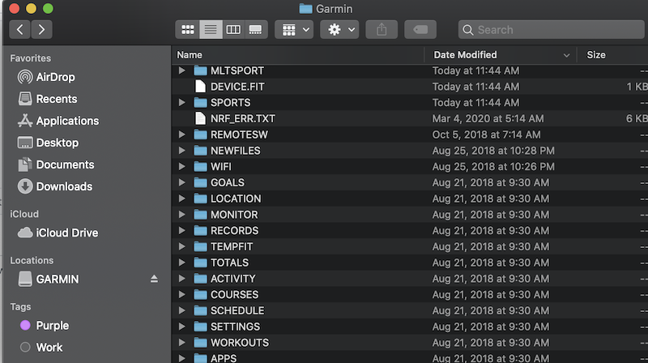

# Garmin-Manual-Upload

Manually uploading your Garmin watch data to your fitness software of choice e.g Strava, MapMyFitness, ....

In this example we will be manually sync garmin watch data with MapMyRun and connecting MapMyRun to IRONMAN Virtual club. 

If you are simply getting your garmin data from your device to your fitness company of choice simply doing the manual upload will suffice. 

## 1. Connect your Garmin device to your mac or pc

My Garmin Forerunner 920 xt comes with a charging cable so since bluetooth won't work for this manual upload we will connect via the chargning cable. Once your mac has detected the watch connection you are able to view your watch data files in the Finder window. 

## 2. Go to MapMyRun or Strava or your fitness site of choice to do a manual upload

Below I'll be using MapMyRun for the manual upload. However Strava or other should be very similar if the site provides manual activity uploads.

#### 1. Add workout from the dashboard 

#### 2. Click on import workouts 

#### 3. Import workout 

#### 4. Click on the Choose File from the File Upload dialog 

#### 5. Select the .FIT,.TCX or .GPX file

Navigate to the **ACTIVITY** folder and select your activity.

Congratulations your activity should now be synced. 🥳

#### MapMyRun workout manually uploaded

#### Strava workout manually uploaded

## 3. If syncing your garmin data to IRONMAN Virtual club 

#### 1. Connect MapMyRun app 

#### 2. Activity should be sync with every manual upload from step 2 above. 

Congratulations your IRONMAN VR activity should now be synced. 🏃🏾‍♂️ 🚴🏾‍♂️ 🏃🏾‍♂️

